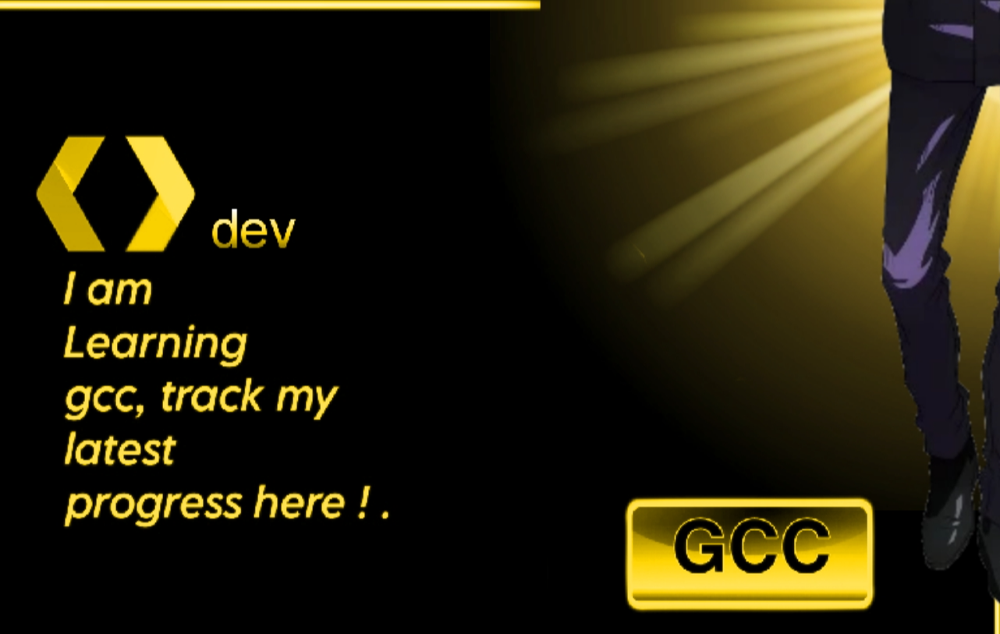

  #I am Computer Science Student 🐧
  #I am Learning AWS
  #I Love 😍 to share and learn codes
  #Learn ..........
<a href="https://dev.to/GaganHonor"><picture><source media="(min-width: 769px) and (prefers-color-scheme: light)" srcset="https://github.com/GaganHonor/GaganHonor/blob/main/readme/light-tl%402x-100.jpg"><source media="(max-width: 768px) and (prefers-color-scheme: light)" srcset="readme/light-tlm@2x-100.jpg"><source media="(max-width: 768px) and (prefers-color-scheme: dark)" srcset="readme/dark-tlm@2x-100.jpg"></picture></a><a href="https://github.com/GaganHonor/a11y-monsters"><picture><source media="(min-width: 769px) and (prefers-color-scheme: light)" srcset="readme/light-tr@2x-100.jpg"><source media="(max-width: 768px) and (prefers-color-scheme: light)" srcset="readme/light-trm@2x-100.jpg"><source media="(max-width: 768px) and (prefers-color-scheme: dark)" srcset="readme/dark-trm@2x-100.jpg"></picture></a><a href="https://github.com/GaganHonor/WCAG101"><picture><source media="(min-width: 769px) and (prefers-color-scheme: light)" srcset="readme/light-bl@2x-100.jpg"><source media="(max-width: 768px) and (prefers-color-scheme: light)" srcset="readme/light-blm@2x-100.jpg"><source media="(max-width: 768px) and (prefers-color-scheme: dark)" srcset="readme/dark-blm@2x-100.jpg"></picture></a><a href="https://tota11y.dev"><picture><source media="(min-width: 769px) and (prefers-color-scheme: light)" srcset="readme/light-br@2x-100.jpg"><source media="(max-width: 768px) and (prefers-color-scheme: light)" srcset="readme/light-brm@2x-100.jpg"><source media="(max-width: 768px) and (prefers-color-scheme: dark)" srcset="readme/dark-brm@2x-100.jpg"></picture></a>

